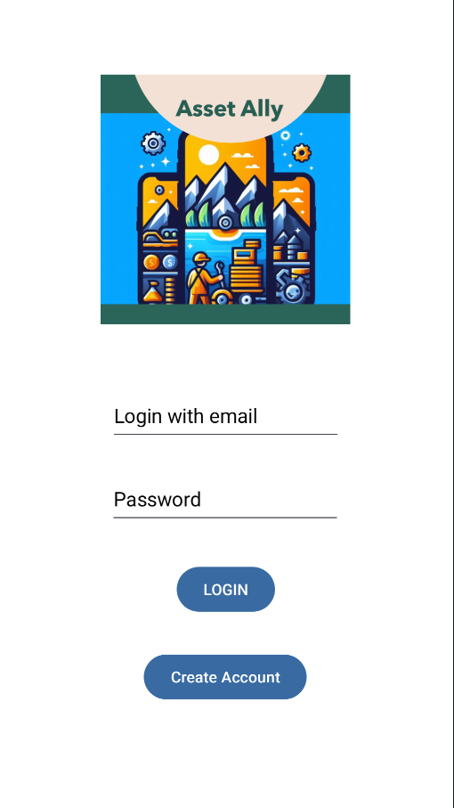
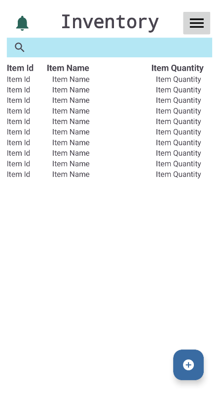
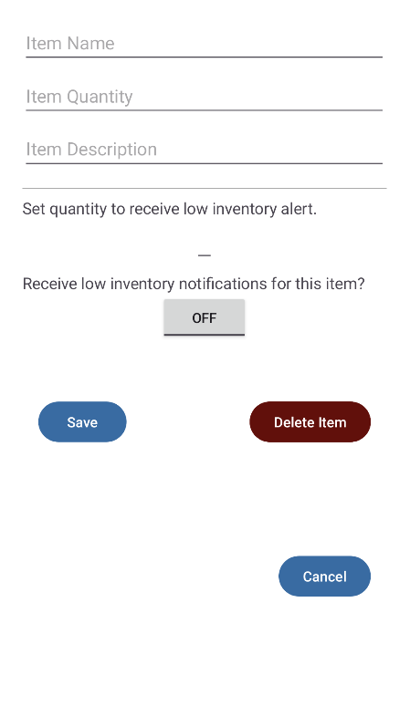

# Asset_Ally

**A streamlined inventory management app for efficient asset tracking and low-stock alerts.**

### Introduction

**AssetAlly** is an Android application designed to simplify inventory management by providing users with essential tools to track, manage, and receive alerts for their assets. The app is ideal for small businesses or personal use, offering a straightforward interface and essential features to keep your inventory organized.

### App Screenshots

| | | |
|:----------------------------------------:|:----------------------------------------:|:----------------------------------------:|
| Login Screen                 | Main inventory view               | Item detail view for adding new items or updating exisiting items                 |

### Features

- **User Authentication:** Secure login system to protect access to your inventory.
- **Inventory Management:** Add, edit, and delete items in your inventory with ease.
- **Real-Time Updates:** Backend connected to a SQL database hosted on a Raspberry Pi, ensuring data is always up-to-date.
- **Low Quantity Alerts:** Automatic notifications when an item's quantity drops below a specified threshold, helping you restock on time.

### Technologies Used

- **Frontend:** Java, XML (Android Studio)
- **Backend:** SQL database (hosted on Raspberry Pi)
- **Authentication:** Android Studio’s built-in authentication methods
- **Database:** SQL for data management and persistence
- **Server:** Raspberry Pi configured as a SQL server

### Installation & Setup
- Clone the repository: git clone https://github.com/mcigliola/AssetAlly.git
- Open in Android Studio: Import the project into Android Studio.
- Database Setup: You can either set up the SQL database on your local machine or experiment with hosting it on a Raspberry Pi (instructions below).
- Set up environment variables: Configure the connection settings in the app to link to your chosen database.
- Build and Run: Use Android Studio to build the project and deploy it to your Android device or emulator.

### Optional: Raspberry Pi Setup
For those interested in experimenting with a Raspberry Pi as the backend server:

Step 1: Install and configure SQL on your Raspberry Pi.
Step 2: Update the app's connection settings to point to the Raspberry Pi server.
Step 3: Test the connection to ensure the app can communicate with the Raspberry Pi-hosted database.

### Usage

- **Login:** Enter your credentials to access the app.
- **Manage Inventory:** Use the interface to add new items, update existing ones, or remove them from the inventory.
- **Monitor Alerts:** Receive notifications when items are running low in stock, ensuring timely restocking.

### Project Scope

- **Role:** Full-stack developer responsible for both the Android front-end and SQL back-end integration.
- **Challenges:** Ensured seamless communication between the app and the Raspberry Pi-hosted SQL server, tackled issues with real-time data syncing, and implemented secure authentication.
- **Learning Outcomes:** Gained experience in Android app development, backend server management on Raspberry Pi, and database integration.

### Future Enhancements

- **Enhanced Reporting:** Add features for generating detailed inventory reports.
- **Multi-user Support:** Enable multiple user roles with varying permissions.
- **Cloud Integration:** Shift the backend from a local server to a cloud-based solution for better scalability.

### Contact

- **GitHub:** [mcigliola](https://github.com/mcigliola)
- **LinkedIn:** [Mary Cigliola](https://linkedin.com/in/mary-cigliola)

  
**In what specific component from your mobile app were you particularly successful in demonstrating your knowledge, skills, and experience?  **

  I am quite proud of this whole app, to be honest.  I have demonstrated my skills in planning and building features that meet the user’s needs without added clutter.  The use of fragments and dialog boxes allows the       user to move through their workflow without needing to navigate away from the main activity.  I will continue to work on it and add more features I think it should have beyond those required for this project.  

